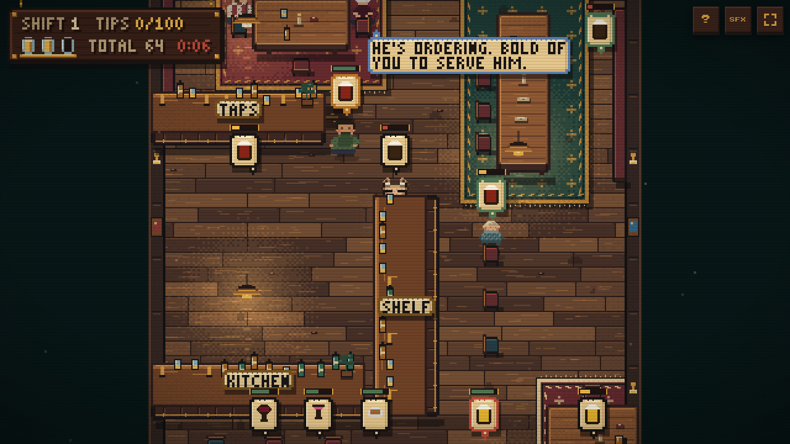

# Le Pub: The Chase

A compact pixel-art serving game where a waiter in a deer onesie works a crowded pub while a hunter stalks the room. Pick orders up at the right station, deliver them before the customer loses patience, and keep moving long enough to close the shift.

**Live demo:** [lepub.vercel.app](https://lepub.vercel.app)



## Art direction gallery

Four visual redesign concepts live in [`concepts/`](concepts/). They use the same cast and gameplay scenario to compare cinematic, neon-noir, character-led, and arcade-first approaches without changing the playable build.

The selected direction is documented in
[`assets/art-direction/`](assets/art-direction/): a warm, crowded night pub
translated into the existing straight-overhead, gameplay-first camera. The
reference controls palette, materials, lighting, and decorative density—not
the room projection or collision layout.

The renderer uses a 2x internal art grid over the unchanged logical world, so
fine sprite contours, narrow floorboards, furniture bevels, glassware, candle
light, and wood grain remain crisp without changing movement or collision.

With the local server running, open <http://localhost:8917/concepts/>. Use `1` through `4` or the arrow keys to switch directions, and press `P` for an uncluttered preview.

## Play the game

Le Pub is a static browser game. It has no build step, package manager, runtime dependencies, or backend.

To play locally, clone the repository and start any static file server from its root:

```powershell
git clone https://github.com/S-Belanger/LePub.git
Set-Location LePub
npx --yes serve . --listen 8917
```

Then open <http://localhost:8917>. If Python is already installed, this works too:

```powershell
python -m http.server 8917
```

Opening `index.html` directly also works in modern browsers, although serving the folder over HTTP is more reliable for image loading and closer to production behavior.

## How to play

1. Watch for order tickets above seated customers, the three corner-table regulars — and, now and then, the hunter.
2. Pick orders up at the station that makes them: beers and water at the **TAPS**, wine and cocktails at the **SHELF**, food from the **KITCHEN**. The tray holds two, but a full tray slows you down; land both without a hit for a double.
3. Carry them to their customers. You can deliver beside the customer or anywhere close to their table.
4. Tips scale with how fresh the order still is: 10 to 20, plus a clutch bonus for a last-second save. Letting an order expire costs 15.
5. Avoid the hunter. He walks in a little after you start, prowls, and only chases once he's actually seen you. Contact removes one of three pints and briefly shoves you to safety. Buy him a pint and he sits it out for a while.
6. Work the shift. The first five run three minutes with a last-call rush; every shift closes on a tally board, and each one makes the pub busier and the hunter sharper. Keep Nazim drinking for double tips — or let Gerald order him a water.

Life begins regenerating after three hit-free seconds. A fully empty bar takes 20 seconds to refill, and the third hit before recovery ends the shift.

### Controls

| Action | Keyboard | Touch |
| --- | --- | --- |
| Move | `WASD` or arrow keys | Left virtual stick |
| Grab / deliver | `E` or `Space` | Right action button |
| Mute sound effects | `M` | `SFX` button |
| Pause / help | `Escape` or `?` button | `?` button |
| Restart after being caught | `Space` | On-screen restart/action button |
| Fullscreen | Fullscreen button | Fullscreen button, where supported |

The canvas adapts to landscape and portrait screens using integer CSS scaling
over a 2x art backing store, so the finer pixel work remains crisp instead of
being stretched across fractional pixels.

## The corner-table regulars

Nazim, Sam, and Gerald keep permanent seats at the booth in the upper-left corner. They participate in the same order queue as walk-in customers, but each has distinct patience, drink preferences, mood, dialogue, and reactions to the chase.

- **Nazim** is patient and orders steadily. Alcoholic deliveries move him through five visible intoxication stages; food does not.
- **Sam** has balanced patience and tends toward cocktails, food, and blond beer.
- **Gerald** is the most impatient, favors dark beer, and becomes increasingly opinionated about the room.

Their dialogue reacts to successful and missed deliveries, near misses, the hunter approaching the booth, level changes, long waits, idle play, and other events. Dialogue never pauses the chase.

## Gameplay systems

- **Fair order queue:** the bar serves the oldest unclaimed order across walk-ins and regulars.
- **Patience:** each order bubble includes a green, amber, or red countdown bar.
- **Delivery feedback:** score changes float above the affected customer, while order bubbles pop in and shrink away on a whole-pixel animation.
- **Life and recovery:** three partially refillable segments, a short post-hit invulnerability window, collision-aware knockback, and visible player flicker.
- **Difficulty:** each shift adds customers, speeds up arrivals, widens the hunter's sight and sharpens his tracking, and deepens the night tint.
- **Responsive presentation:** separate portrait and landscape viewports, camera clamping, safe-area-aware controls, and optional fullscreen.
- **Sound:** lightweight synthesized Web Audio cues with no audio downloads; the mute preference is stored locally when browser storage is available.
- **Reduced motion:** ambient dust, lamp flicker, and seated sway are disabled when the operating system requests reduced motion.

## Project structure

The game uses classic scripts that share one global scope. Their order in `index.html` is intentional.

| Path | Purpose |
| --- | --- |
| `index.html` | Fullscreen canvas shell, help panel, touch controls, and script order |
| `style.css` | Responsive layout, safe areas, overlay controls, and pixel scaling |
| `game.js` | Mutable game state, input, entities, collision, AI, update loop, rendering, and debug helpers |
| `src/pixelfont.js` | Small bitmap font, measurement, drawing, and word wrapping |
| `src/scenery.js` | Pub palette, seeded scenery helpers, glow baking, and vignette baking |
| `src/sprites.js` | Sprite DSL, character art, palettes, and order icons |
| `src/dialogue-content.js` | Authored lines and multi-character exchanges |
| `src/dialogue.js` | Dialogue selection, priorities, cooldowns, queueing, and repetition control |
| `src/regulars.js` | Regular configuration, order weighting, mood, and Nazim's intoxication rules |
| `src/sound.js` | Lazy Web Audio initialization and synthesized sound cues |
| `assets/` | Gameplay screenshot, game-over art, level-completion art, and the floor-plan reference |

Static room art and lighting textures are baked into 2x offscreen canvases.
Sprite renders are cached by sprite, palette, and facing; collision dimensions
remain separate from visual sheets, while furniture and characters share one
pooled y-sorted render pass.

## Development

Edit the HTML, CSS, or JavaScript and refresh the browser. There is no compilation or generated bundle.

Active work is checkpointed in [`HANDOFF.md`](HANDOFF.md). Repository-level
continuity rules in [`AGENTS.md`](AGENTS.md) require updating that handoff after
each meaningful milestone, so an interrupted session can resume safely.

There is no build step or linter. Run the syntax and smoke checks from PowerShell:

```powershell
node --check game.js
Get-ChildItem src -Filter *.js | ForEach-Object { node --check $_.FullName }
node tests/smoke.js
git diff --check
```

The dependency-free smoke test loads the production scripts in their real
order, runs every customer seat route in and out, completes a waiter visit,
and exercises the render pass against a lightweight canvas/DOM stand-in.

For browser testing, exercise both a wide desktop viewport and a portrait mobile viewport. Useful checks include resizing during a run, simultaneous movement and touch interaction, restarting after a catch, muting before and after the first sound, and closing a shift on both the clock and the tips target.

### Debug console

`game.js` exposes a disposable `window.__debug` object for manual browser-console testing:

```js
__debug.forceRegularOrder('nazim', 'beer-blond');
__debug.setNazimDrinks(5);
__debug.setScore(100);
__debug.setLife(1 / 3);
__debug.triggerDialogue('hunterNear');
__debug.forceCaught();
__debug.resetGame();
```

Other helpers expose the current viewport, camera, reserved seats, regular state, dialogue queue, score, life, and level-splash state. This debug object is not a public API.

## Deploying

The repository is ready to deploy as a plain static Vercel project. No framework preset, build command, or output directory is required.

With the PowerShell deployment helper configured in the development environment:

```powershell
shipit "Deploy Le Pub" -Direct
```

Or use the Vercel CLI directly:

```powershell
vercel deploy --prod --yes
```

The `.vercel/` directory and local environment files should remain untracked.

## Browser support

Le Pub targets current desktop and mobile browsers with Canvas 2D and Pointer Events. Web Audio is optional: when it is unavailable, the sound control is hidden and gameplay continues silently. Fullscreen is also optional and disappears when the browser does not expose the API.
