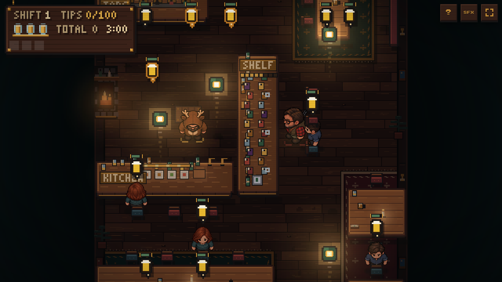
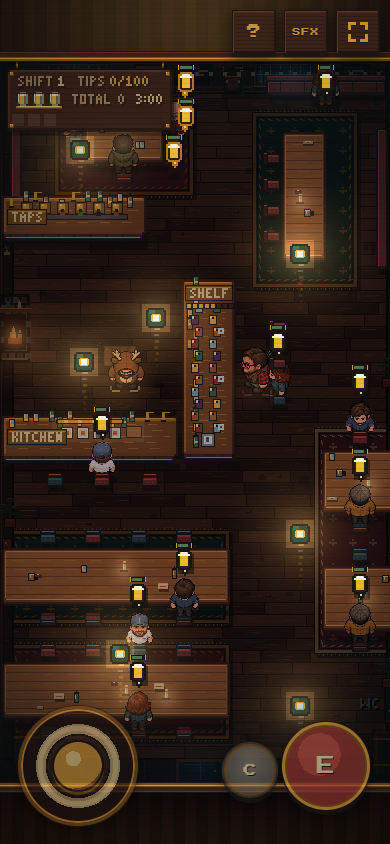

<h1 align="center">🍻 Le Pub: The Chase</h1>

<p align="center">
  <strong>Serve the regulars. Dodge the hunter. Close the shift.</strong>
</p>

<p align="center">
  A browser arcade game set in a warm, crowded neighborhood pub.<br>
  One waiter in a deer onesie. A tray full of orders. A hunter who won't leave you alone.
</p>

<p align="center">
  <a href="https://lepub-five.vercel.app/">
    
  </a>
  <a href="https://github.com/S-Belanger/LePub/actions/workflows/validate.yml">
    
  </a>
  
  
</p>

<p align="center">
  <a href="https://lepub-five.vercel.app/"><strong>▶ Play the game</strong></a> ·
  <a href="#how-to-play">How to play</a> ·
  <a href="#quick-start">Run locally</a> ·
  <a href="#documentation">Documentation</a> ·
  <a href="CHANGELOG.md">Changelog</a>
</p>

## A night at Le Pub

<table>
  <tr>
    <th>Desktop</th>
    <th>Phone / touch</th>
  </tr>
  <tr>
    <td align="center">
      <a href="docs/art-review/nick/full-cast/desktop-gameplay.png">
        
      </a>
    </td>
    <td align="center">
      <a href="docs/art-review/nick/full-cast/mobile-gameplay.png">
        
      </a>
    </td>
  </tr>
</table>

<p align="center"><sub>Current illustrated cast and room rendering, captured during local desktop and phone-emulation review. Click either image for the full-size view.</sub></p>

## The game

**Le Pub: The Chase** combines table service, resource management and a pursuit
through a busy overhead pub. Fetch drinks and food from the right station,
deliver before customers lose patience, and keep the shift moving while the
hunter searches for you.

- **A pub with personality.** Nazim, Sam and Gerald keep their corner booth,
  place orders and trade dialogue as the night unfolds.
- **A growing illustrated cast.** Twelve production sprite atlases include
  Jay, Nick, Alex, Fred and distinct walk-in customers, with authored directions
  and gameplay poses.
- **Pressure beyond the orders.** Hunter pursuits, cigarette breaks, bathroom
  urgency, rounds, Nick's interruptions and Alex's floor-blocking split keep
  the room unpredictable.
- **A haunted cellar.** Restock the shelf by heat-sealing fresh bottles below
  the bar, dodge the ghost and return upstairs with supplies.
- **Shifts that get busier.** Tips, patience and last call shape each shift;
  later shifts bring more customers and a tougher hunter.
- **Keyboard or touch.** The canvas adapts to desktop and portrait screens,
  with virtual controls, optional fullscreen and synthesized sound effects.

The game runs on plain **HTML, CSS and JavaScript**, using **Canvas 2D** and
optional Web Audio. There is no framework, build step, backend or runtime
package dependency.

## How to play

1. **Read the tickets.** Orders appear above customers and the regulars.
2. **Visit the right station.** Beer and water come from the **TAPS**, wine and
   cocktails from the **SHELF**, and food from the **KITCHEN**. Carry up to two
   orders; a full tray slows you down.
3. **Deliver quickly.** Interact beside the customer or their table to earn
   tips before patience runs out.
4. **Stay ahead of the hunter.** Break his line of sight, use the room's routes
   and keep an eye on your three-pint life bar. A Jameson shot can briefly turn
   the chase in your favor.
5. **Keep the pub supplied.** When the shelf runs dry, use the hatch behind the
   bar, seal bottles in the cellar and avoid the ghost.
6. **Close the shift.** Reach the tips target or survive until last call on the
   timed shifts, review the tally and continue into the next one.

### Controls

| Action | Keyboard | Touch / on-screen |
| --- | --- | --- |
| Move | `WASD` or arrow keys | Left virtual stick |
| Grab / deliver / interact | `E` or `Space` | Right `E` button |
| Drop a cigarette pack | `C` | `C` button |
| Heat-seal a bottle in the cellar | Hold `E` or `Space` | Hold the right action button |
| Pause / help | `Escape` | `?` button |
| Mute sound effects | `M` | `SFX` button |
| Continue after a shift | `E` or `Space` | On-screen action |
| Restart after being caught | `Space` | Restart button |
| Fullscreen | Fullscreen button | Fullscreen button where supported |

Sound initializes after interaction. Fullscreen and audio controls depend on
browser support; gameplay remains available without them.

## Meet the cast

| Character | Role in the pub |
| --- | --- |
| **The deer waiter** | You: serving tables, carrying orders and surviving the chase |
| **The hunter** | Searches the room and pursues you when he spots you |
| **Nazim, Sam & Gerald** | Permanent corner-booth regulars with distinct orders, moods and dialogue |
| **Jay** | A returning member of the waiter rotation |
| **Nick** | Baseball uniform, ginger beard, backward cap and an illustrated apology after his interruptions |
| **Alex** | Drops in for a split, briefly blocking a patch of floor |
| **Fred & the walk-ins** | Illustrated customer appearances sharing the pub's seating and order systems |

<details>
  <summary><strong>View Nick, Jay and Alex — illustrated cast and pose showcase</strong></summary>

  <p>
    
  </p>

  <p>Reviewed source art and imported production frames, shown at inspection scale.
  See <a href="docs/art-review/nick/README.md">Nick's in-game review</a> and
  <a href="assets/sprites/nick-prompt.md">exact generation and refinement prompts</a>.</p>
</details>

The visual direction combines dark walnut, burgundy seating, brass, parchment
and amber light with detailed overhead character illustrations. The game uses
a 4× art backing canvas while movement and collision stay in logical world
coordinates. Character image density and feet pivots determine display size.

For new artwork, follow the [visual system](docs/VISUAL-SYSTEM.md) and
[illustrated asset notes](assets/sprites/ILLUSTRATED.md). Production art and
load-failure fallback are separate: the ghost's procedural material is
intentional, and the busboy remains documented art debt.

## Quick start

Install [Git](https://git-scm.com/) and [Node.js](https://nodejs.org/), then run:

```powershell
git clone https://github.com/S-Belanger/LePub.git
Set-Location LePub
node tools/serve.js 8917
```

Open **[http://127.0.0.1:8917/](http://127.0.0.1:8917/)**. The preview server
uses Node's built-in modules; no `npm install` or build command is needed.
Edit the source and refresh the page. Stop the server with `Ctrl+C`.

If you already have Python, `python -m http.server 8917` is another option.
Serving over HTTP is recommended for reliable asset loading.

With the local server running, you can also open:

- [Character gallery](http://127.0.0.1:8917/tools/art-review.html): directions,
  poses, animation and display-size controls for the production cast.
- [Nick's gallery card](http://127.0.0.1:8917/tools/art-review.html#nick).
- [Historical art concepts](http://127.0.0.1:8917/concepts/): four exploratory
  directions. These are design studies; the current visual system governs art.

## Development and validation

The runtime uses ten classic scripts, loaded in the order declared by
`index.html`. There is no bundler or compilation step.

### Automated checks

Run the same dependency-free Node suites used by the
[GitHub Actions workflow](.github/workflows/validate.yml):

```powershell
node tests/character-art.js
node tests/assets.js
node tests/smoke.js
node tests/alex.js
node tests/cellar.js
git diff --check
```

These check the character contract and assets, customer routes and gameplay,
Alex's lifecycle and the cellar. The smoke suite uses a DOM/canvas stand-in;
it does not replace a real-browser visual review.

### Browser and art review

```powershell
node tools/validate-art.js
node tools/validate-nick.js
```

The current browser harness requires local **Microsoft Edge** and an existing
**`playwright-core`** installation accessible to the tools. These are review-tool
requirements, separate from the game and its dependency-free preview server.
It captures desktop/phone-emulation evidence and exercises assets, input,
rotation and fallback; Nick's focused check drives his real special-pose lifecycle.
Inspect the captures as well as the reports. See the
[review instructions](docs/claude/05-REVIEW-TROUBLESHOOTING.md) for prerequisites,
commands, acceptance criteria and verification limits.

### Project structure

| Path | Purpose |
| --- | --- |
| [`index.html`](index.html), [`style.css`](style.css) | Canvas shell, help panel, responsive layout and touch controls |
| [`game.js`](game.js) | Game state, orders, entities, collision, hunter AI, shifts, cellar, input and rendering |
| [`src/`](src/) | Pixel font, scenery, sprite fallback, dialogue, regulars and audio modules |
| [`src/assets.js`](src/assets.js) | Atlas validation, loading, frame lookup and per-family fallback |
| [`src/character-art.js`](src/character-art.js) | Shared character family, scale, direction and required-pose contract |
| [`assets/sprites/`](assets/sprites/) | Illustrated PNG sources, frame metadata, manifest and prompt records |
| [`tools/`](tools/) | Local preview server, art importer, gallery and browser validators |
| [`tests/`](tests/) | Dependency-free contract, asset and gameplay checks |
| [`docs/`](docs/) | Visual standards, reviewed evidence, Claude handbook and collaborator records |

## Documentation

| Guide | Start here when… |
| --- | --- |
| [Visual system](docs/VISUAL-SYSTEM.md) | Adding or changing characters, textures, props or UI |
| [Illustrated assets](assets/sprites/ILLUSTRATED.md) | Understanding production sheets, source provenance and animation limits |
| [Claude sprite handbook](docs/claude/README.md) | Reproducing the approved cast style with Claude or a manual image-tool handoff |
| [Copyable art prompts](docs/claude/03-PROMPTS.md) | Preparing a character generation, targeted edit or integration task |
| [Nick review and screenshots](docs/art-review/nick/README.md) | Inspecting his source, real gameplay poses and validation evidence |
| [Collaborator changelog](CHANGELOG.md) | Finding what changed, who worked on it and the actual outcome |
| [Collaboration logging](docs/collaboration/README.md) | Recording requests, prompts, methods, failures, checks and publication |
| [Current handoff](HANDOFF.md) | Resuming work with the latest branch, file, test and next-step state |
| [Contributor rules](AGENTS.md) | Starting any Codex, Claude or human contribution |

Before editing, read `AGENTS.md`, the handoff and the latest collaboration
record. Preserve existing work and keep the changelog/session journal current.
Art contributions require the actual shipped references, declared poses,
technical checks and inspected desktop/mobile captures.

## Hosting

**Live game: [lepub-five.vercel.app](https://lepub-five.vercel.app/)**

The repository can be served as a static site. It needs no application build,
server-side service or environment variables to run the game. Keep the HTML,
CSS, scripts and assets together so relative paths remain valid. Local Vercel
metadata and environment files remain untracked.

The game targets modern desktop and mobile browsers with Canvas 2D and Pointer
Events. Saved review images document local Edge and phone emulation; physical
device testing is separate.
