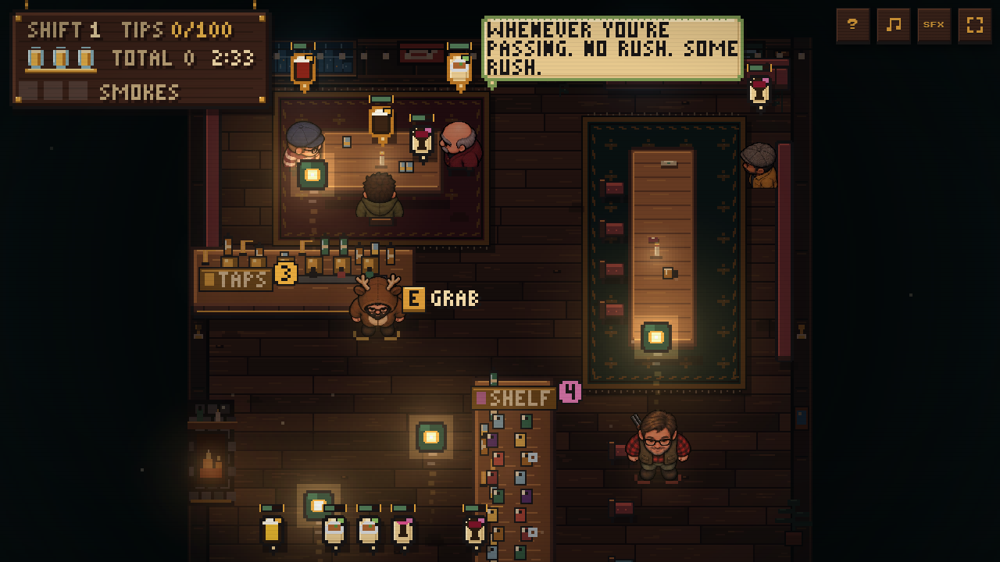

# Le Pub: The Chase

A pixel-art serving game for the CDN crowd. You're a waiter in a deer onesie
working a packed pub while a hunter stalks the room. Grab each order at the
counter that makes it, get it to the table before they give up, and don't get
caught.

**Play:** [lepub.vercel.app](https://lepub.vercel.app). It runs in any current
browser, on a phone or a laptop, with touch, keyboard or a gamepad.



## How to play

The game teaches itself. Tip cards explain each mechanic the first time it
comes up in a run, and **HOW TO PLAY** on the pause panel opens the
illustrated House Rules. The short version:

1. **Spot a ticket.** The bar on top is their patience. Fresher service tips
   more (10 to 20, plus a clutch bonus for a save in the red); a ticket that
   runs out costs 15.
2. **Grab it at its counter.** Beer and water at the **taps**, wine and
   cocktails at the **shelf**, food at the **kitchen**. Each counter has its
   own colour, and so does the corner of every ticket it makes. A number on
   the counter means orders are waiting there, and the ringed one has the
   oldest. The tray holds two.
3. **Serve it, dodge him.** The hunter sees what's in front of him. Each catch
   costs one of three pints; stay clear and they refill. Buy him a pint and
   he sits down for a while.

Then there's the Jameson (ten seconds untouchable), packs of smokes (drop one
and he steps out), rounds for the corner booth, Nazim's slow slide from sober
to gone, the bladder dash to the WC, and Alex's splits. Shifts last three
minutes with a tips target; the last 15 seconds are last call. From shift 6
there's no clock, just the target.

| Action | Keyboard | Touch | Gamepad |
| --- | --- | --- | --- |
| Move | `WASD` / arrows | Left stick | Stick / d-pad |
| Grab / serve (also start, next shift, restart) | `E` / `Space` | `E` button | `A` |
| Drop a pack of smokes | `C` | `C` button | `X` |
| Pause, House Rules | `Esc` | `?` chip | `Start` |
| Sound effects / music | `M` / `N` | `SFX` / note chips | |

The game pauses itself if you switch apps or tabs mid-shift.

## The corner booth

**Nazim**, **Sam** and **Gerald** hold the booth all night. They order like
anyone else (amber tickets), talk about what you're doing, and have their own
patience and tastes. Gerald has the least of the first and the most opinions.
Every drink moves Nazim along; drunk Nazim tips double but spills, and a water
sobers him up.

## Run it locally

No build step, no dependencies. Serve the folder and open it:

```sh
node tools/serve.js            # http://127.0.0.1:8917
# or: python -m http.server 8917
```

Edit any file and reload.

## Project layout

```
index.html        the page; its <script> list is the load order
style.css         DOM shell (walnut, brass, parchment, same as the canvas)
src/engine/       font, sound, ambience/music, dialogue scheduler, atlas loader
src/art/          palette, sprite DSL and fallback cast, character-art contract
src/content/      dialogue lines, regulars config
src/game/         game state, one file per system (render/ holds the drawing)
assets/           what the page downloads: WebP sprite sheets, splash images
art-source/       lossless PNG masters of the sprite sheets (not deployed)
docs/             ARCHITECTURE.md (how it works), VISUAL-SYSTEM.md (art standard)
tests/, tools/    checks and the art pipeline
```

[docs/ARCHITECTURE.md](docs/ARCHITECTURE.md) explains every system.
[CLAUDE.md](CLAUDE.md) is the short version, with the rules that keep it
working (and it's what AI assistants read first).

## Checks

```sh
node tests/run.js
```

This runs what CI runs on every push: a syntax check of every script, the
character-art contract, the asset loader tests, a smoke run of the real game
in a fake DOM (every seat route, serving, the hunter, shifts, the booth,
guidance), and Alex's scheduling. For art or UI changes, also run
`node tools/validate-art.js <out-dir>` (needs Edge and `playwright-core` in
the npx cache) and look at the desktop and phone captures it saves.

In the browser console, `window.__debug` drives the game by hand:
`__debug.giveJameson()`, `__debug.callRound()`, `__debug.setNazimDrinks(5)`,
`__debug.setShiftClock(170)`, `__debug.forceCaught()` and more (see
`src/game/debug.js`).

## Art pipeline

Characters are illustrated sprite sheets described by JSON atlases. New or
redrawn characters follow [docs/VISUAL-SYSTEM.md](docs/VISUAL-SYSTEM.md):

```sh
# 1. put the PNG master in art-source/sprites/<family>-illustrated.png
node tools/import-illustrated.js <family>   # 2. measure frames, write the JSON
node tools/build-sprites.js <family>        # 3. encode the WebP the game ships
```

`tools/art-review.html` (with the local server running) shows the whole cast
in every direction and pose.

## Deploying

It's a static site on Vercel with no build command or framework preset.
`.vercelignore` keeps the masters, docs, tests and tools out of the upload.

```sh
vercel deploy --prod
```
