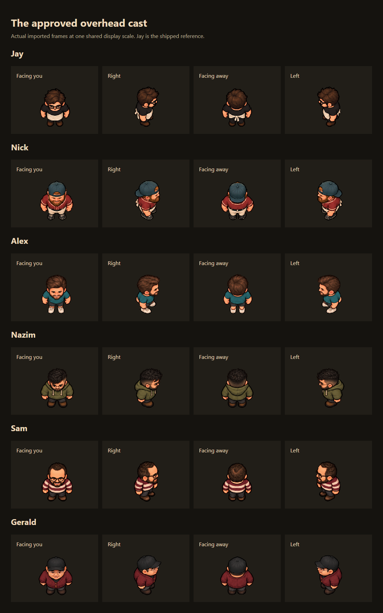

# Approved cast perspective and regular likeness review

October 6, 2026. User approved Nick B and requested Alex's same natural
overhead head/gaze angle, new Nazim/Gerald/Sam portrait likenesses, durable
authoring guidance and production publication. Nick uses the exact approved
source; Alex retains his original illustrated identity. The three regulars
use the new portrait identities with their existing pub outfits and poses.



The comparison uses actual production idle frames beside shipped Jay, at one
display scale6. It is a browser capture, not new generated artwork. Reproduce:
`node docs/art-review/cast-perspective/capture.js`.
Nick's backward cap, Gerald's forward cap, Nazim's wire glasses and Sam's
receding hair/no cap follow their respective identities. Heads look forward
along the floor, crowns visible, faces foreshortened beneath the fixed camera.

## Source and integration

All five sources are unchanged accepted1254×1254 transparent built-in imagegen
outputs, with16 frames each. Image generator backend model is unavailable.
No private portrait copy is published. Exact prompts, source provenance and
measured cuts/density:

| Family | Prompt/provenance | Row cuts | Authored pixels/world unit |
| --- | --- | --- | --- |
| Nick | [Approved B revision](../../../assets/sprites/nick-prompt.md#approved-october-6-perspective-revision) | 0,328,629,917,1254 | 13.5238095238 |
| Alex | [Head-angle edit](../../../assets/sprites/alex-perspective.md) | 0,344,663,968,1254 | 11.6190476190 |
| Nazim | [New likeness](../../../assets/sprites/nazim-likeness.md) | 0,321,638,934,1254 | 12 |
| Sam | [New likeness](../../../assets/sprites/sam-likeness.md) | 0,312,621,927,1254 | 12.5714285714 |
| Gerald | [New likeness](../../../assets/sprites/gerald-likeness.md) | 0,314,617,907,1254 | 12.9047619048 |

`node tools/measure-illustrated-rows.js nick alex nazim sam gerald` PASS;
`node tools/import-illustrated.js nick alex nazim sam gerald` PASS80 alpha/edge
checked cells. Silhouette128 thresholds differ from fully alpha-zero pixels.
One density per family preserves the21-world-unit maximum idle scale including
crop padding. Mechanics, collisions and special-pose ownership remain intact;
Alex retains his1.5-unit split floor offset and22×7 blocker.

## Fresh local checks

Six Node suites PASS: `node tests/character-art.js`, `node tests/assets.js`,
`node tests/smoke.js`, `node tests/alex.js`, `node tests/cellar.js`,
`node tests/hud.js`. Character art covers11kinds/12families/5regression guards;
assets31checks; smoke10scripts/40routes; Alex13gates/full lifecycle.

Real Edge browser commands all exit0:

```sh
node tools/validate-art.js docs/art-review/cast-perspective/full-cast
node tools/validate-nick.js docs/art-review/cast-perspective/nick
node tools/validate-alex.js docs/art-review/cast-perspective/alex
node tools/validate-hud.js docs/art-review/cast-perspective/hud
```

- [Full-cast report](full-cast/report.json):12ready atlases,160pose mappings
  per desktop/mobile view, actual lean/slump/talk, keyboard/touch movement,
  rotation, isolated Doe404fallback. Zero unexpected browser errors.
- [Nick report](nick/report.json): entry walk,4directions/16poses, actual
  fart→apology→idle, reset, missing-Nick resilience and12gallery captures.
- [Alex report](alex/report.json):16non-clipped source cells,4walk directions,
  full split→stand→leave/reset,23.4959world-unit split width,22×7blocker,
  missing-sheet and reduced-motion checks. Zero browser errors.
- [HUD report](hud/hud-report.json):390×844,375×667,360×780,320×568 touch
  viewports, loaded regular bodies clear HUD, status/help/cellar/rotation and
  reduced-motion startup.

Inspected [desktop room](full-cast/desktop-gameplay.png),
[phone room](full-cast/mobile-gameplay.png),
[desktop split](alex/desktop-split.png), [phone split](alex/mobile-split.png),
[Nick comparison/apology poses](nick/preview.png),
[phone apology](nick/mobile-sorry.png) and
[small-phone HUD](hud/hud-320x568.png). Native frames remain legible; fine
identity/finger detail reduces at phone size. No physical-phone test or GPU
performance claim. Report CPU timings are render-submission-only samples.

First full-cast navigation timed out waiting networkidle30s. An identical
request-instrumented reproduction passed; retry passed all four validators.
No speculative harness change or weaker assertions. The failed attempt remains
in the [release journal](../../collaboration/2026-10-06-cast-perspective-release.md).

## Future character work and publication

Use the [visual system](../../VISUAL-SYSTEM.md),
[Claude handbook](../../claude/README.md) and current shipped reference pixels.
New templates/prompts distinguish likeness from camera/outfit references and
require measured source boundaries, floor pivots, pose anatomy and native-size
game review. Original recipes and historical reviews remain preserved.

Publication is authorized; the
[release journal](../../collaboration/2026-10-06-cast-perspective-release.md)
and newest [handoff](../../../HANDOFF.md) record actual commit, independently
verified remote SHA, CI and current production receipts when obtained.
