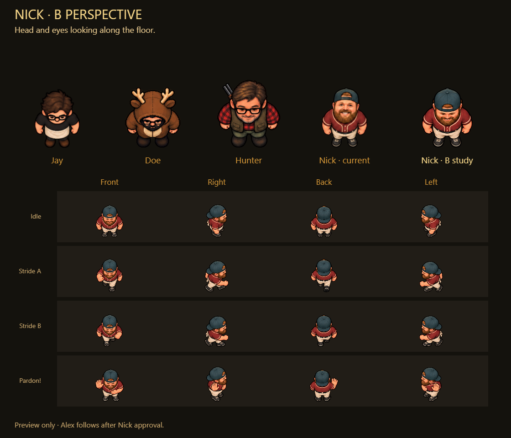
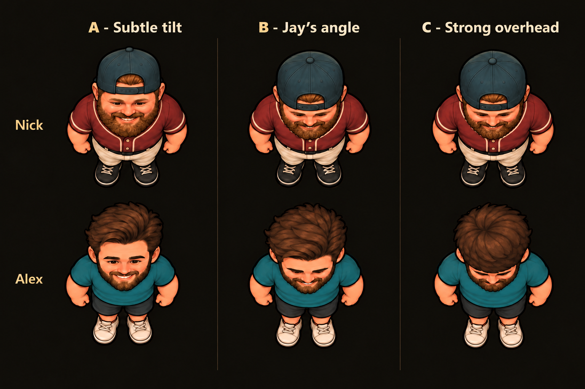

# Same-face overhead angle studies — preview only

**Selected direction:** user chose **B — Jay's angle** on October 6, 2026. The middle column of the corrected board below is the approved benchmark for Nick/Alex head pitch and crown-to-face proportions. Keep their existing likenesses and outfits when applying this direction to future sprite edits.

## Nick-only follow-up — awaiting approval

[Nick desktop comparison](nick-b-desktop.png) · [Nick mobile comparison](nick-b-mobile.png) · [Transparent Nick study](nick-b-candidate.png) · [Exact edit prompt](nick-b-prompt.md) · [Measured browser report](nick-b-report.json)

The user requested this concrete Nick study and explicitly conditions Alex edits on Nick approval. The board uses actual shipped reference frames, shows old/new Nick at the same world-unit density convention, then four directions of idle/two strides/apology. Head pitch and eye direction now follow the floor-facing B direction rather than the original upturned face. Recognisable Nick likeness/outfit retained; these raster edits reinterpret facial pixels.

`node docs/art-review/face-perspective/render-nick-b.js` passed actual Edge desktop1200x900 and mobile/touch390x844. Candidate1254x1254,16 non-clipped cells,57.074% fully transparent pixels; measured row seams0/328/629/917/1254; one13.5238095 authored-pixels-per-world-unit preview density gives21-unit maximum idle height. Both captures inspected. Report measures opaque silhouettes at alpha>=128, not proof of hand-cleaned translucent edges. No game integration, production Node suites, gameplay browser validation, physical-phone, CI or live-deployment claim. Original Nick/Alex/Jay/Doe/Hunter PNG blobs match HEAD.

The capture harness initially failed twice replacing an image document; synthetic HTML navigation fixed that. First gutter selection picked a gap edge; selecting gap centers fixed the false clipping result while preserving source pixels/assertions. Failures and exact commands are retained in the session journal.

Nick approval is pending. Alex stays unchanged until that explicit approval arrives. The new candidate is stored outside production assets and is not selected by the game manifest.

[Corrected comparison board](preview.png) · [Initial board](initial-preview.png) · [Exact initial prompt](prompt.md) · [Targeted cap correction](cap-correction-prompt.md) · [Session journal](../../collaboration/2026-10-06-face-perspective-previews.md)

- **A — Subtle tilt:** modest downward correction; most facial detail visible.
- **B — Jay's angle:** more crown and a foreshortened downward-facing head, closest to the shipped Jay reference. Recommended starting point.
- **C — Strong overhead:** strongest crown emphasis, especially Alex. Nick's cap correction restored his backward adjustment opening but also exposed more face than the initial C study, making his B/C angles less distinct. Treat C as an exploratory range, not a final precise camera specification.

Codex used built-in identity-preserving image edits of the existing Nick/Alex sheets, with Jay's sheet and the supplied cast board as posture/context references. No new-person identity was requested. The editing tool reinterprets pixels: recognisable likeness is retained, but unchanged original face pixels cannot be guaranteed. No raw personal photographs were added. Full prompt/input roles/options and both output attempts are preserved in the journal.

The earlier1536x1024 A/B/C boards are review examples. No production sprites, metadata, manifest, character contract or gameplay were replaced. B is now selected; the subsequent Nick-only study above awaits approval before Alex edits and any production integration.
