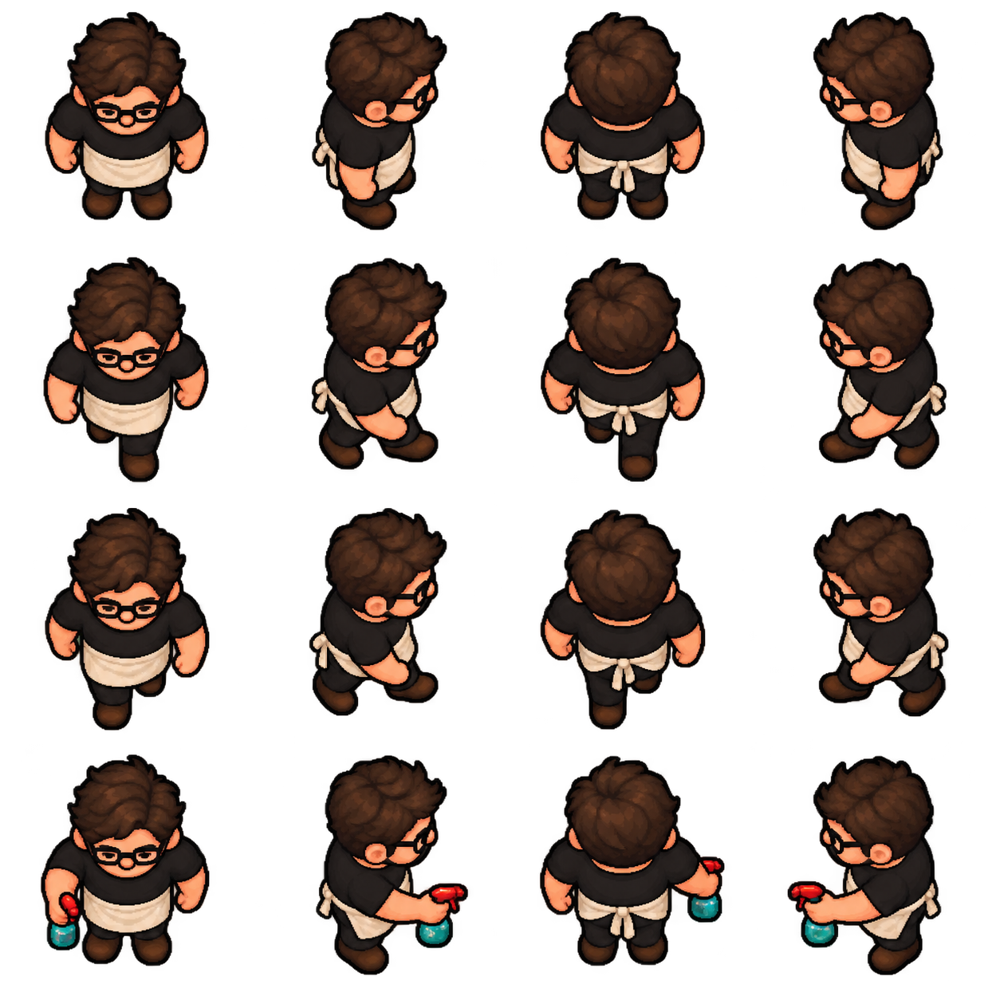
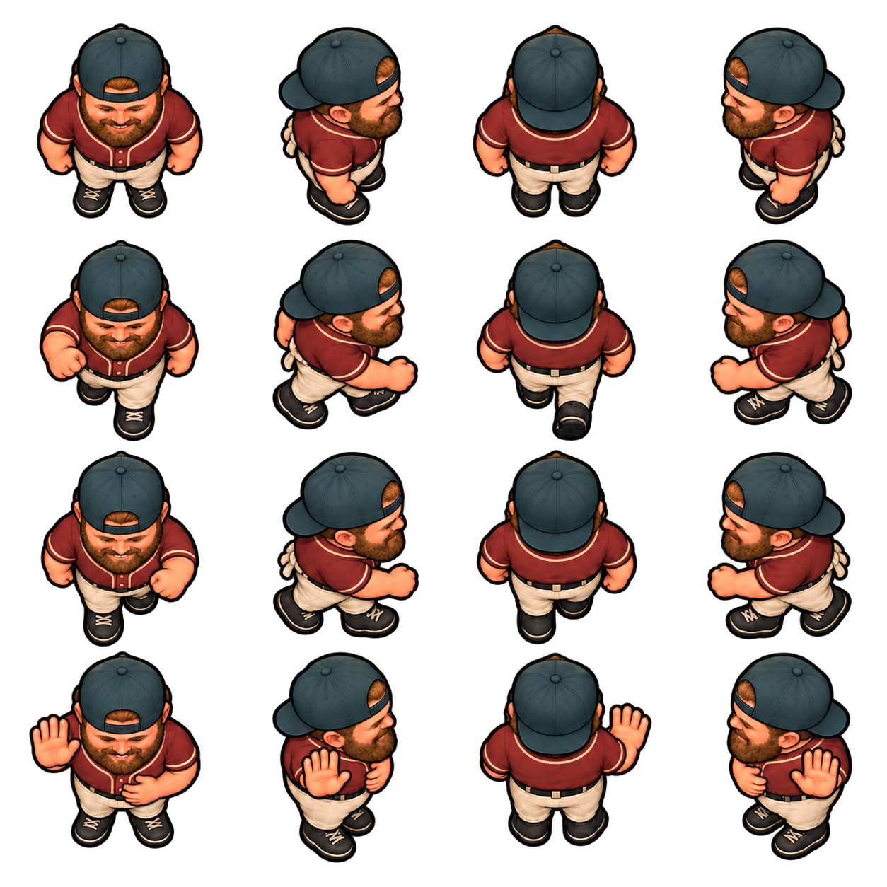

# 1. Match the shipped art, using the images themselves

[Start here](README.md) · [Next: workflow](02-WORKFLOW.md)

## The reference pack

Open these as images. Reading their paths or filenames is not visual inspection.

| Reference | What it controls | What it does not control |
| --- | --- | --- |
| [User-approved Nick B sheet](../art-review/face-perspective/nick-b-candidate.png) and [actual cast comparison](../art-review/face-perspective/nick-b-desktop.png) | Definitive relaxed head pitch and gaze along the floor; crown/face balance and elevated side views | A new person's likeness, baseball costume, apology, or source-specific seams |
| [Jay's illustrated sheet](../../assets/sprites/waiter-illustrated.png) | Primary finish, compact anatomy, contour, elevated camera, fabric shading, all-direction layout | A new character's identity, glasses, apron or spray bottle |
| [Doe](../../assets/sprites/doe-illustrated.png) / [Hunter](../../assets/sprites/hunter-illustrated.png) | Additional shipped overhead finish and where heads/eyes point in the room | A new person's hood, antlers, glasses, rifle or identity |
| [Alex's illustrated sheet](../../assets/sprites/alex-illustrated.png) | Approved costume, beard/cloth finish and split pose contract | Older lifted-face gaze; a revision only becomes a gaze reference after review against Nick B |
| [Nick's production sheet](../../assets/sprites/nick-illustrated.png) | Backward cap, baseball costume, two strides and apology | Permission to revive earlier portrait-facing gaze or reuse old seam numbers for changed pixels |
| [Camera study](../../assets/art-direction/overhead/character-camera-study.png) | Visible crowns/shoulders and foreshortening in each cardinal direction | Current final likenesses or its painted backdrop |
| [Room painting](../../assets/art-direction/warm-overhead-pub-reference.png) | Warm materials, light and color harmony | Literal room geometry, isometric conversion, floor under a sprite |
| [Approved floor plan](../../assets/art-direction/floor-plan.png) | Routes, layout and placement constraints | Permission to change colliders to accommodate a new image |
| The user's identity photo | Face shape, hair, beard, distinctive identity | Camera, clothing or background unless the user explicitly requests them |

The atlas images are transparent. A viewer may display black or a checkerboard
under that transparency. The viewer's backdrop must not become part of a new asset.

## Supply actual reference pixels to the generator

For a typical new person, attach in this order:

1. Identity photo, if there is one. Label it “identity only,” or specify exactly
   which parts of its clothes are also required.
2. Jay's **illustrated** PNG. Label it “finish, anatomy and overhead camera.”
3. User-approved Nick B PNG. Label it “head pitch/gaze along floor; overhead
   elevation only, not this person's identity or costume.”
4. Existing character atlas for a revision, or a precise costume/pose study.
   Label it “outfit, row order, actions and anatomical ownership.”
5. Doe/Hunter if extra camera/finish comparison is useful. Keep roles explicit.

If no identity photo exists, attach Jay/Nick B and describe the requested identity;
renumber the prompt's image references to match the actual attachments.

An external generator cannot read `assets/sprites/waiter-illustrated.png`
merely because that text appears in a prompt. The file must be uploaded or
supplied through the tool's supported image-input mechanism. Claude being
able to open the local file is separate from the generator receiving it.

A portrait shows a person at eye level. Without explicit role separation,
the generator may borrow that camera or costume. A room painting may tempt
it to add a floor or shadow. Give each attachment one clear purpose.

Keep raw personal photos outside public/served assets, or explicitly ignored
and excluded from deployment. A photo can be untracked and still served under
`assets/`; `.gitignore` is not itself a static-host exclusion. Do not duplicate
private originals in the guide, screenshots, prompt history or review folder.

## Anatomy and camera: the non-negotiable silhouette

The cast is compact and slightly stout, with an enlarged readable head,
short foreshortened limbs, visible shoulders, and a strong continuous contour.
It is a detailed raster illustration sampled onto the game's crisp canvas.
It is not a flat emoji, geometric vector person, low-detail stick figure,
photoreal cutout, or a tall eye-level RPG portrait.

The camera is high overhead, approximately 65 degrees above horizontal.
The visible result matters more than the number:

People look **along the floor toward their cardinal facing direction**.
They do not raise their head or eyes toward the overhead viewer. Preserve a
relaxed, cheerful expression and natural pitch, rather than a defeated bow.

- Facing down: crown/hair or cap occupies substantial area; the face remains
  readable below it; shoulders are visible from above.
- Facing up: the top/back of the head dominates; the rear shoulders and outfit
  read clearly. Do not paint a front face on the back of the head.
- Facing right/left: retain the same elevation. The cap crown and shoulder
  tops remain visible; the torso/legs stay foreshortened.
- A side cell must not become an eye-level profile with a long neck and long legs.

Use Nick B for the head-angle decision. Lowering only pupils or eyelids while
keeping a lifted portrait face is insufficient: correct head pitch and the
projected crown/forehead/face balance. Avoid the opposite error of hiding all
likeness under an excessively bowed head. Inspect idle, both strides and every
special; a good down-facing idle alone does not establish all-direction parity.

Compare head-to-body ratio, shoulder width and feet placement directly with Jay.
The entire character should feel as if photographed by the same fixed camera
when rotated, rather than redrawn in four unrelated illustration styles.

## Finish and materials

Use a dark warm contour with readable breaks for hands, face and shoes.
Inside the contour, include actual authored detail: hair/beard clumps, cap
panel seams, cloth folds, piping, buttons, shoe soles, and layered shading.
Keep highlights controlled. The source should be legible in amber light and
in the darker gaps between lamps.

| Material/color family | Useful anchors | Treatment |
| --- | --- | --- |
| Burgundy cloth | `#8d342f`, `#652b2b` | Muted fabric, darker seams, modest warm highlights |
| Teal/slate cloth | `#263d43` | Cool contrast to pub lighting, shaded folds |
| Cream cloth | `#e6d8b4`, parchment relatives | Warm off-white, not fluorescent white |
| Skin | Match the person's identity | Base/light/shadow with readable facial features |
| Beard/hair | Match the person's identity | Distinct clumps and contour, not a single flat fill |
| Boots/shoes | Dark warm neutrals or specified costume | Sole/lace detail without giant reflective highlights |

These anchors guide harmony; do not quantize the illustrated PNG to a hard
30-color palette. Smooth alpha and additional colors are allowed. Equally,
do not oversaturate every jersey or add neon outlines to create visibility.

Lighting is predominantly warm from the upper left. Do not bake a lamp disc,
large floor shadow, room vignette or floor texture into a character sheet.
The runtime provides grounding and room light.

## Identity must survive all sixteen cells

Write the identity as concrete observations: face shape, skin tone, forehead,
hairline, beard shape/color, glasses shape, cap direction and characteristic
smile. “Looks like Nick” alone is less useful than that description plus his photo.

For an existing character, edit the existing illustrated likeness; do not
invent a different person to solve camera. A changed projection can preserve
likeness but does not guarantee identical facial pixels. Record that limit
and inspect the entire edit, including regions asked to remain unchanged.

Keep the same identity in every direction and pose. A backward cap has its
adjustment opening/strap at the forehead and brim at the back. The up-facing
cell should show that rear brim. A beard should not disappear in one side view.

Track anatomical ownership rather than screen coordinates:

- “His right hand holds the bottle” is stable when the figure turns.
- “The bottle is on the right of the image” is not stable when he turns.
- A tattoo or chest print must remain on the same anatomical side.
- Author left and right views. Do not mirror the whole person if it would
  swap an asymmetric prop, tattoo, chest emblem, hand or cap feature.

## Layout and poses

For the usual supporting-person contract, request one square transparent sheet:

| Row / column | Down, toward viewer | Right | Up, away | Left |
| --- | --- | --- | --- | --- |
| 1 | Idle | Idle | Idle | Idle |
| 2 | Walk A | Walk A | Walk A | Walk A |
| 3 | Walk B, opposite phase | Walk B, opposite phase | Walk B, opposite phase | Walk B, opposite phase |
| 4 | Required special action | Required special action | Required special action | Required special action |

Leave generous transparent gutters. Ask for at least 12% margin at each cell
edge. Generated spacing may still vary; measure it before deciding how to import.
Every figure must be complete and separate, including raised hands and extended feet.

Walk A and Walk B need different limb phases, not merely a changed facial
expression or two nearly identical silhouettes. When the left leg advances,
the right arm normally advances; reverse them for the other stride. Review
the rear and side cells closely because mistakes are easier to miss there.

The fourth row is the actual required gameplay pose. It might be talk, spray,
drink, apology or split. Do not assume every family has the same layout:
Nazim has explicit lean/slump rows, and floor poses may require special pivots.
Read the family's contract and gameplay before prompting.

## Scale: compare at the same world size

Supporting people have a maximum idle crop height of 21 world units; leads
use 24. Source density must be at least four pixels per world unit. The
importer derives one density for the whole family from its maximum idle crop.

A large PNG is not inherently HD art. Upscaling a 40x44 procedural figure
preserves its sparse detail. Conversely, a richly painted source can look
wrong if its metadata makes it twice as tall as Jay. Both asset authorship
and the integration scale must be correct.

Use native desktop and phone sizes to make the decision. A close-up is useful
for anatomy and texture; it cannot prove that the character reads in the pub.
