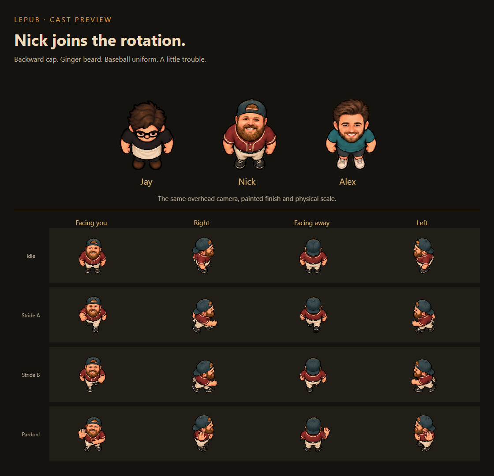

# LePub illustrated sprites: the complete guide for Claude users

This folder teaches a person using Claude or Claude Code how to produce and
integrate characters that meet the same art standard as the approved
Codex/Astra work. Start here. Last verified against this checkout: October 6, 2026.

The target is the **actual illustrated cast in the production manifest**.
It is not whichever historical document says “pixel art,” and it is not the
small procedural figures still retained in `src/sprites.js` for resilience.



## First, understand what went wrong

The referenced Nick commit, `eb7d72e`, added behavior and a procedural
`ohFigure` appearance. Its `src/character-art.js` explicitly listed Nick as
art debt. Its `assets/sprites/nick-prompt.md` called the illustrated prompt
“proposed, unrun.” The later `c915e9d` still had no illustrated Nick atlas.

That evidence establishes a missing production-art step. It does not tell
us why the collaborator stopped there or what image tools their session had.
The code integration and the finished raster artwork are separate deliverables.

For the accepted Nick, Codex called its built-in image-generation tool with
the portrait plus shipped Jay/Alex sheets. It inspected the generated image,
corrected the walking phase, measured its actual spacing, imported the PNG,
connected the atlas, and reviewed the result in the real game. Writing a
description, drawing polygons in code, or exporting a procedural figure to a
large PNG does not reproduce that process.

## Claude is the coordinator; verify the image tool

Anthropic describes Claude's built-in visuals as HTML/SVG rather than
equivalent photo/illustration generation. It can analyze supplied images.
That is why a Claude session needs access to an appropriate external raster
generator, or a human handoff to one, for this workflow.
[Official capability explanation](https://support.claude.com/en/articles/9002504-can-claude-produce-images).

Claude Code can connect to external tools through MCP.
[Official MCP documentation](https://code.claude.com/docs/en/mcp).
The existence of MCP does not establish that a particular installation has
an image-generation tool or that its tool can accept these reference files.
Use the capability check in [the workflow](02-WORKFLOW.md).

The previous Codex session's `image_gen` is an environment tool, not a
JavaScript library in LePub. Writing its name in a Claude prompt does not
make it callable there. We did not record a public underlying image-model
identifier; do not invent one or promise access to the same backend.

## What “exactly the same” can mean

| Desired result | Reliable approach |
| --- | --- |
| The exact approved Nick artwork | Reuse `nick-illustrated.png`, its metadata and the matching character contract. Do not regenerate him. |
| The same style for a new person | Supply actual shipped PNGs as image references, preserve camera/material/scale rules, then iterate and review against them. |
| A fresh generation with identical pixels to an earlier generation | A prompt alone cannot guarantee this. Keep the accepted source and verify its file hash. |
| The same in-game appearance | Use correct frame bounds, density, pivots, animation selection and room rendering as well as the correct PNG. |

The purpose of this guide is to make the same production method and visual
standard repeatable. It does not claim that changing the coding assistant
turns stochastic image generation into deterministic asset reproduction.

## Read in this order

1. [Style and reference pack](01-STYLE-AND-REFERENCES.md): exactly what to match,
   what each reference controls, and what the anatomy/camera should look like.
2. [Full workflow](02-WORKFLOW.md): Claude Code, manual handoff, connected tools,
   and the sequence from brief through accepted asset.
3. [Copyable prompts](03-PROMPTS.md): paste-ready instructions for Claude and
   the image generator, including targeted corrections.
4. [Atlas integration](04-ATLAS-INTEGRATION.md): files, code, scale math,
   measured seams, pivots, runtime poses and failure recovery.
5. [Review and troubleshooting](05-REVIEW-TROUBLESHOOTING.md): objective checks,
   visual checks, rejection examples and honest completion evidence.
6. [Worked Nick example](06-NICK-CASE-STUDY.md): what was actually generated,
   what failed, why the import fix was legitimate, and what passed.

Use [the character brief](templates/CHARACTER-BRIEF.md) before generating.
Use [the review record](templates/REVIEW-RECORD.md) before calling an asset done.

## The shortest useful instruction to paste into Claude Code

```text
Work in the LePub repository. Read HANDOFF.md completely and preserve all
existing uncommitted work. Read docs/VISUAL-SYSTEM.md, then docs/claude/README.md
and the linked workflow. Visually inspect the actual shipped Jay and Alex PNGs.

I want [CHARACTER] in the approved illustrated cast style. Establish the
required directions and gameplay poses, then check what real raster-generation
and reference-image editing tools this session can use. If none is available,
prepare the brief, attachment list and exact prompt for a manual image-tool
handoff. Do not substitute SVG, procedural drawing or an upscaled placeholder.

Preserve existing gameplay/colliders/UI. Generate or import actual illustrated
RGBA art, measure the atlas with the repository importer, wire its contract and
manifest, and validate in the real game at desktop and phone size. Show the
result beside the cast. Keep HANDOFF.md current. Leave publication to my
instructions; do not claim unrun tests or unpublished art are complete.
```

Replace `[CHARACTER]` and provide the identity/costume details. Nick is already
finished in this checkout: use him as a reference, not as a task to recreate.

## Precedence and scope

The user's current request and `HANDOFF.md` control the task. Repository
`AGENTS.md` controls continuity. [The visual system](../VISUAL-SYSTEM.md)
controls current art. This folder translates those requirements for Claude;
it does not supersede them.

Older `ART-PLAN.md` and overhaul/handoff sections contain superseded camera,
scale and asset plans. Current source code controls current gameplay timing;
do not apply a historical timing paragraph while adding artwork.

This is a project guide, not an installed Claude plugin, MCP server, or claim
that a collaborator's machine has a configured generator. Reference links
require a checkout containing the approved assets. Share the PNGs and metadata
as well as the guide when transferring work between machines.
